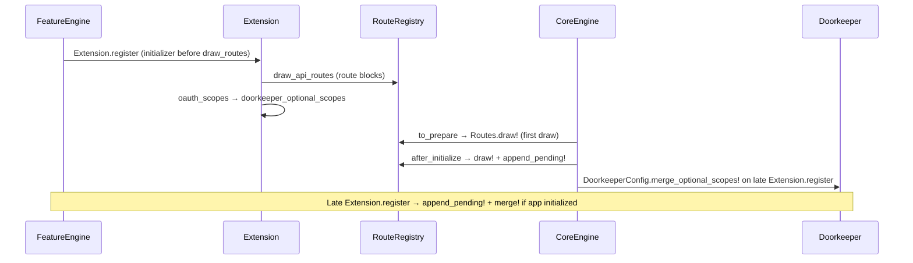

## Overview

**For:** gem maintainers wiring `Decidim::RestFull::Extension.register` — read this after [Recipe](./recipe.md) when routes or scopes do not appear.

## Boot sequence



## Initializer anchors

Register your engine initializer **before** core draws routes and merges scopes:

```ruby
initializer "rest_full.widgets.extension", before: "rest_full.draw_routes" do
  Decidim::RestFull::Extension.register(:widgets) do |ext|
    ext.oauth_scopes :widgets
    ext.permissions(:widgets, "widgets.read", group: :widgets)
    ext.routes do
      Decidim::RestFull::Routing.read_resources(self, :widgets, controller: "widgets/widgets", only: [:index, :show])
    end
    ext.rswag_specs File.join(Widgets::ENGINE_ROOT, "spec/requests/decidim/api/rest_full/widgets/**/*_spec.rb")
    ext.open_api_definitions File.join(Widgets::ENGINE_ROOT, "lib/decidim/rest_full/widgets/test_definitions.rb")
  end
end
```

| Anchor | Purpose |
|--------|---------|
| `before: "rest_full.draw_routes"` | Route blocks collected before first `Routes.draw!` |
| `before: "rest_full.scopes"` | Belt-and-suspenders for OAuth scope collection |

## Extension.register

Public DSL: [`decidim-restfull-core/lib/decidim/rest_full/extension.rb`](https://git.octree.ch/decidim/vocacity/decidim-modules/decidim-rest_full/-/blob/main/decidim-restfull-core/lib/decidim/rest_full/extension.rb).

| Method | Registers |
|--------|-----------|
| `oauth_scopes` | Doorkeeper optional scopes (merged at `after_initialize`) |
| `permissions` | System-admin API permission checkboxes |
| `routes` | Route block → `RouteRegistry` |
| `api_job` | Async mutation handler |
| `rswag_specs` | OpenAPI request spec globs |
| `open_api_definitions` | Schema barrel for OpenAPI |
| `webhooks` | ActiveSupport::Notifications patterns |

When `Extension.register` runs **after** routes are already drawn, `Routes.append_pending!` adds new blocks without a full redraw.

Registering the **same route block twice** raises `Decidim::RestFull::Core::DuplicateRouteBlockError` (fail-fast; no duplicate Rails routes).

## OAuth scopes

Core optional scopes live on [`DoorkeeperConfig::CORE_OPTIONAL_SCOPES`](https://git.octree.ch/decidim/vocacity/decidim-modules/decidim-rest_full/-/blob/main/decidim-restfull-core/lib/decidim/rest_full/core/doorkeeper_config.rb).

Gems add **new** scopes only:

```ruby
ext.oauth_scopes :widgets   # skip if already in core list
ext.permissions(:widgets, "widgets.read", group: :widgets)
```

Merge runs at boot in the `rest_full.scopes` initializer. Late `Extension.register` calls `DoorkeeperConfig.merge_optional_scopes!` when `Rails.application.initialized?`.

See [Scopes and permissions](./scopes-and-permissions.md).

## Host app extensions

Host apps may register from `config/initializers/` inside `Rails.application.config.after_initialize`:

```ruby
Rails.application.config.after_initialize do
  require "decidim/rest_full"

  Decidim::RestFull::Extension.register(:my_feature) do |ext|
    ext.routes { get "my_resource/:id", to: "/decidim/my_app/my_resources#show" }
  end
end
```

`Extension.register` appends routes and re-merges scopes when the app is already initialized. See [Host app extensions](../host-app-extension.md).

:::warning
Host controllers must **not** live under `Decidim::Api::RestFull::*` (Zeitwerk conflict with `decidim-api`). Use an app-specific namespace.
:::

## RouteRegistry

[`RouteRegistry`](https://git.octree.ch/decidim/vocacity/decidim-modules/decidim-rest_full/-/blob/main/decidim-restfull-core/lib/decidim/rest_full/core/route_registry.rb) collects route blocks from feature gems and draws them under `/api/rest_full/v<major.minor>/` on `Decidim::Core::Engine.routes`.

Public entry: `Decidim::RestFull::Routes.draw!` (called from core engine; do not call from `spec_helper`).

## Related specs

| Case | Path |
|------|------|
| Route registry | `decidim-restfull-core/spec/lib/decidim/rest_full/core/route_registry_spec.rb` |
| Routing DSL | `decidim-restfull-core/spec/lib/decidim/rest_full/routing_spec.rb` |
| Routes boot | `decidim-restfull-core/spec/requests/decidim/api/rest_full/routes_boot_spec.rb` |

## See also

- [Recipe](./recipe.md)
- [Routing](./routing.md)
- [Architecture](../architecture.md)
