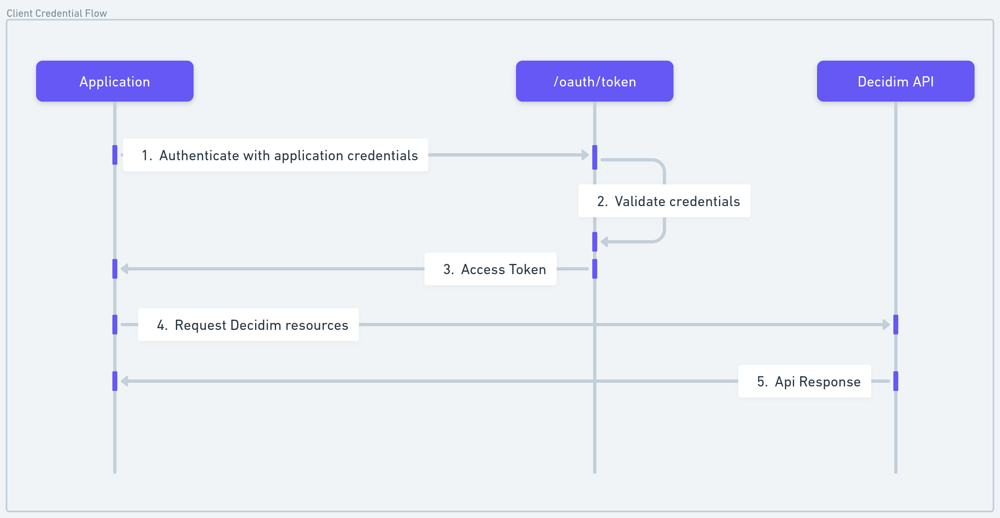
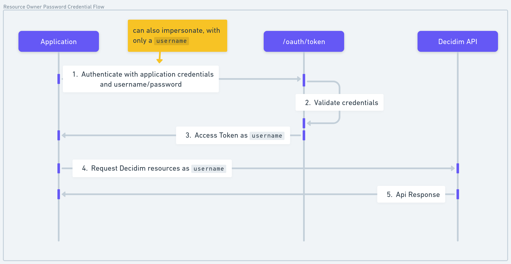

# How does it work?
This module expose API Rest endpoint for Decidim. It uses secure workflows from OAuth2.0, leveraging the famous `doorkeeper` and `devise` gem. 

This module: 
- Manages from system administration new client credential
- Supports machine-to-machine and user tokens

It exposes for now only a _set of endpoints_, but the goal of this module is to support all the resources and actions available in Decidim. ([See Supported Resources](#supported-resources))

## Authentication flows

Machine-to-machine flow (Client Credential Flow): 

User token flow (Resource Owner Password Credential Flow)

## Supported Resources

| Scopes     	| Resource                	| Supported operations 	|
|------------	|-------------------------	|----------------------	|
| `system`     	| organizations           	| Read                 	|
| `public`     	| search                  	| Read                 	|
| `spaces`     	| assemblies              	| -                    	|
| `spaces`     	| participatory_processes 	| -                    	|
| `spaces`     	| conferences             	| -                    	|
| `components` 	| components              	| -                    	|
| `proposals`  	| proposals               	| -                    	|
| `proposals`  	| proposal_drafts         	| -                    	|
| `proposals`  	| proposal_amendments     	| -                    	|
| `proposals`  	| proposal_comments       	| -                    	|
| `proposals`  	| proposal_votes          	| -                    	|

:::info
Each scope has its sets of fine-grained permissions, allowing to 
cherry-pick what the authenticated system can do in the Decidim application.
:::