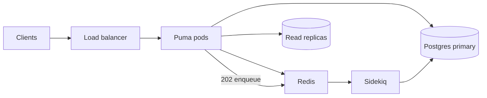

The **gem** must avoid O(n) work per request; the **host app** (Puma fleet, PgBouncer, Redis, Sidekiq, Postgres replicas) carries most of the capacity for large concurrent session counts.

## Responsibilities

| Layer | You own |
|-------|---------|
| **decidim-restfull** | Efficient queries, conditional GET, async writes, OpenAPI contract |
| **Host (Voca / NCA)** | Horizontal Puma, connection pooling, read replicas, rate limits, observability |

See [Installation](/install), [Async writes](/dev/add-endpoint/async), and [HTTP cache](/dev/add-endpoint/http-cache).

## Reference architecture

## Sizing (starting point)

- **Puma:** `WEB_CONCURRENCY` ≈ CPU cores; `RAILS_MAX_THREADS` ≈ 3–5 for I/O-bound API work.
- **DB pool (per process):** `pool ≥ RAILS_MAX_THREADS + 1`. Total connections = workers × pool × **Puma pods** + Sidekiq — use **PgBouncer** in transaction mode.
- **Pods (rough):** `required_puma_pods ≈ target_RPS × avg_latency_seconds / (workers × threads)` — calibrate with k6 after deploy.

100k **sessions** with think time is not 100k RPS. Plan for ~1 meaningful call / 10s / session unless your product differs.

## Environment variables

| Name | Role |
|------|------|
| `DECIDIM_REST_QUEUE_NAME` | Active Job queue for async API jobs |
| `DECIDIM_REST_LOADBALANCER_IPS` | Trusted proxy IPs ([safe host](/dev/update-hosts)) |
| `DECIDIM_REST_MAX_ASYNC_API_JOB_PAYLOAD_BYTES` | Max JSONB job payload |
| Host `DATABASE_URL` | Primary (+ replica URLs for `connected_to(:reading)` in host) |
| `REDIS_URL` | Sidekiq + optional cache |
| `WEB_CONCURRENCY`, `RAILS_MAX_THREADS` | Puma |

## Client patterns at scale

1. **Reads:** send `If-None-Match` / `If-Modified-Since` on `searchComponents`, `getProposal`, `getBlogPost`, list endpoints.
2. **Writes:** prefer async routes (`POST` → `202` + `job_id`); poll `GET /jobs/:uuid` with exponential backoff.
3. **Votes:** default `POST /vote_proposals` (async); use `POST /vote_proposals/sync` when you need an immediate body; add `?include_proposal=true` only when you need the full proposal payload.
4. **Pagination:** use `page` / `per_page`; do not assume unbounded collections.

## Hot endpoints

| operationId | Kind | Default | Caching |
|-------------|------|---------|---------|
| `searchComponents` | GET | sync | conditional GET |
| `listBlogPosts` / `getBlogPost` | GET | sync | conditional GET |
| `getProposal` | GET | sync | conditional GET |
| `castProposalVoteAsync` | POST | async | — |
| `castProposalVote` | POST | sync (`/vote_proposals/sync`) | — |
| `createRole` | POST | async | — |
| `createDraftProposal` | POST | async | — |
| `publishDraftProposalAsync` | POST | async | — |
| `setUserExtendedData` | PUT | async | — |

## Load testing

Run k6 **in Docker** with [`docker-compose.perf.yml`](https://github.com/octree-gva/decidim-rest-full/blob/main/docker-compose.perf.yml) (Redis + k6 on the Compose network). Full steps: [`perf/k6/README.md`](https://github.com/octree-gva/decidim-rest-full/blob/main/perf/k6/README.md).

1. `docker compose -f docker-compose.yml -f docker-compose.perf.yml up -d`
2. Copy [`perf/k6/.env.example`](https://github.com/octree-gva/decidim-rest-full/blob/main/perf/k6/.env.example) → `perf/k6/.env` and seed OAuth + fixture ids (`K6_BASE_URL=http://rest_full:3000` for in-network k6).
3. Start Puma (and Sidekiq for async scenarios) in `rest_full` — see perf README.
4. `docker compose -f docker-compose.yml -f docker-compose.perf.yml --profile perf run --rm k6 run scenarios/smoke.js`
5. Record numbers in [`perf/BASELINE.md`](https://github.com/octree-gva/decidim-rest-full/blob/main/perf/BASELINE.md).

Against staging, set `K6_BASE_URL` in `.env` to your host URL; the same `k6 run` command applies.

## Monitoring checklist

- API RPS, p95/p99 latency, 5xx rate
- **304 rate** on hot GETs (target &gt; 60% with well-behaved clients)
- Postgres pool wait, slow query log
- Sidekiq queue latency (p95 &lt; 5s under peak enqueue)
- Per-org / per-`client_id` rate limits (Rack::Attack in **host**)

## Multi-tenant safety

- Resolve organization from host + token; never share cache keys without `org_id` prefix.
- Job poll `GET /jobs/:uuid` must not leak across organizations (covered in core specs).
- Rate-limit abusive integrators before the database saturates.
