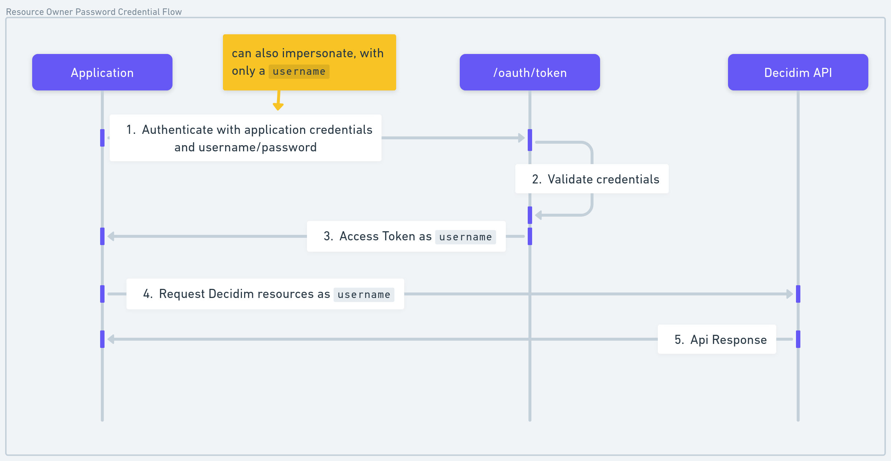

# User Authentication (Resource Owner Password Flow)

This flow allows you to authenticate on behalf of a user, granting access to user-specific data in the Decidim API.
With a ROPC token, you can for example: 
- Create a proposal in behalf of a user
- Follow an assembly in behalf of a user
- Comment
- etc.

This authentication is the default one for most of the endpoints, expect the `system` endpoints that requires a machine-to-machine token.

## Authentication type
The ROPC flows allows two kind of authentication, use the auth_type attribute to define the kind of ROPC you want to do. 
- `impersonate`: look up (or optionally register) a user by nickname/`id`, and act as that user. **No user password** is checked. Intended for trusted API clients (`oauth.impersonate`); the client may act as any user in the organization, including admins.
- `login`: give a username/password, and start acting as the user.

Resource-owner tokens are only issued for **confirmed**, non-blocked, non-locked users. Unconfirmed users are rejected at token issue and on API use (`require_user!`). Use `meta.skip_confirmation_on_register` when creating users that must be confirmed immediately.

## How to Get a Token

Use the `grant_type=password` with user credentials to request an access token. Ensure your OAuth application has the correct client ID, client secret, and scopes.

### Parameters

**login auth type**
- required: **`grant_type`**: Must be `password`.
- required: **`auth_type`**: Must be `login`.
- required: **`username`**: The user's unique identifier (e.g., nickname or email).
- required: **`password`**: The user's password.
- required: **`client_id`**: Your OAuth application Client ID.
- required: **`client_secret`**: Your OAuth application Client Secret.
- required: **`scope`**: The permissions requested (e.g., `public proposals`).

**impersonation auth type**
- required: **`grant_type`**: Must be `password`.
- required: **`auth_type`**: Must be `impersonate`
- **`username`**: The user's unique identifier (e.g., nickname). Required if `id` is not present.
- **`id`**: Optional user id (find by id; ignore username). Forbidden when registering.
- required: **`client_id`**: Your OAuth application Client ID.
- required: **`client_secret`**: Your OAuth application Client Secret.
- required: **`scope`**: The permissions requested (e.g., `public proposals`).
- **`meta`**:
  - **`register_on_missing`**: If user not found, create one. Requires client permission `oauth.impersonate.register` (in addition to `oauth.impersonate`). Default: `false`.
  - **`accept_tos_on_register`**: When `true`, set `accepted_tos_version` to the current org TOS (accepted). When `false`, set `accepted_tos_version` in the past so the user must re-accept TOS in Decidim. Default: `false`.
  - **`skip_confirmation_on_register`**: Confirm the user immediately (no confirmation email). Needed for a usable token on create. Default: `false`.
  - **`name`**: The profile public name, used only if `register_on_missing=true`
  - **`email`**: The profile email, used only if `register_on_missing=true`
- **`extra`**: Merged into `user.extended_data` on find/create. Requires `oauth.extended_data.update`. Subject to `DECIDIM_REST_MAX_EXTENDED_DATA_PAYLOAD_BYTES`. Empty object is a no-op.

Register-on-missing ROPC requests are rate-limited per organization host + `client_id` (Rack::Attack). Configure with `DECIDIM_REST_REGISTER_PER_MINUTE` (default `10`; `0` disables).

### Example Reponse
```json
{
  "access_token": "<token>",
  "token_type": "Bearer",
  "expires_in": 7200,
  "scope": "public proposals"
}
```


## Error Handling
### Invalid Credentials
```json
{
  "error": "invalid_grant",
  "error_description": "The provided authorization grant is invalid, expired, or revoked."
}
```
### Unauthorized Scope
```json
{
  "error": "invalid_scope",
  "error_description": "The requested scope is invalid, unknown, or malformed."
}
```
