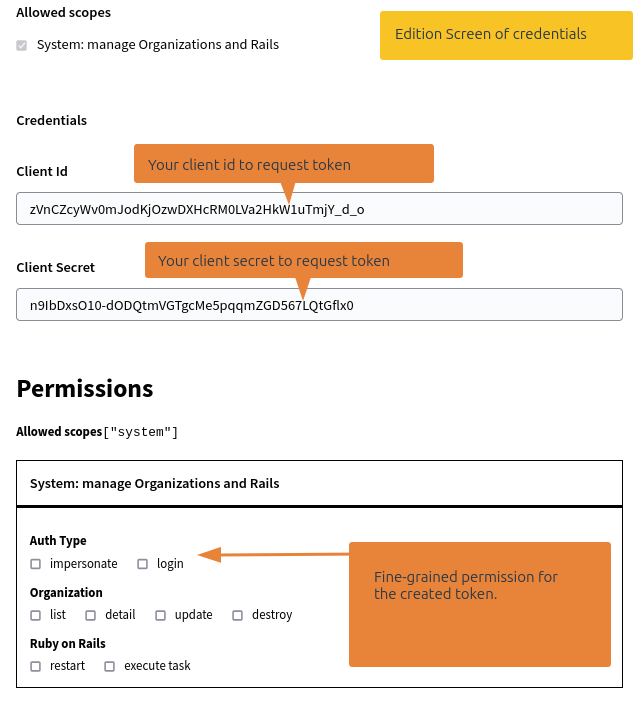

# Administrate your API Client credentials
Administrate your credentials in the `/system` administration panel. You will be able there to 
- Create new credentials
- Edit credentials permissions
- Revoke credentials

## Create new credentials

To create new credentials, goes on the `Api Clients` menu.


You can then create a new credential clicking on `New Api Client`


Now, define a name for credentials, to easily locate it later. Select an organization, to bind the credentials to one of the Decidim Organization (multi-tenant).

Finaly, define **scopes** to give the credential access to some part of your Decidim Data. 


Once created, you lend on the edition screen of the credentials. 

## Edit a credential
You can define fine-grained permissions on the created credentials. 
In this screen, you can also use the `client_id` and `client_secret` used to authenticate you. 



:::info
Fine-grained permissions are editable after the credential creation, 
**scopes** are not. If you need to add a new scope, you need to revoke the credentials, and create a new one. 
:::

## Revoke a credential
At anytime, you can revoke a credentials. This will permantly and immediatly remove access of this client. 
Generated token by this credentials won't be valid anymore, even they are still before date of expiration. 


## Use the `api-client` binary 

The `api-client` binary is available once you have generated the binstubs: 
```ruby
bundle binstub decidim-rest_full
``` 
The binary will be place on your `bin` folder, make sure it is in your `$PATH`. 

:::info 
The use of this binary is optional, 
you can set `DISABLE_REST_FULL_BIN=true` to deactivate completly the `api-client`.
:::
  

**`api-client create --scope [SCOPE] --permission [PERMISSION] --organization-id [DECIDIM_ORG_ID]` [...OPTIONS]**  
Create a client with the given permission. 

* `scope`: one or many scopes for the api credentials. Required
- `organization-id`: The decidim organization linked to the credential. Optional if scope is only `system`, else required.
* `permission`: one or many permissions. Each permissions should be valid for the given scope set. Optional
* `id`: the `client_id`. Optional
- `secret`: the `client_secret`. Optional
- `allow-impersonate`: If the client can impersonate other participants
- `allow-login`: If the client can login using username/password of another participant
- `name`: The name of the credential
- `format`: Outformat, `json` or `text`. `json` by default

:::note
1. By default `api-client create [OPTIONS]` grants **no permission** to the API Client. 
2. `organization-id` is optional if the scope include **only** `system` scope
:::

Examples
```bash
# Get a help menu
api-client create --help 
Usage: api-client create [options]
        --format FORMAT              Output format. `json` or `text`
    -h, --help                       Show command help
        --scope SCOPE                API scope
        --perm, --permission PERMISSION
                                     Permission
        --name NAME                  Client name
        --id ID                      Client ID
        --organization-id ORGANIZATION_ID
                                     Organization ID
        --secret SECRET              Client secret
        --allow-impersonate          If client can impersonate a user
        --allow-login                If client can insert user/password to login
``` 
```bash
# Create a system only credentials, with generated client_id and secret and no permissions
api-client create --scope system 
{"id":"id_FEwz1JiXgP6K3zX7","secret":"key_nzh-Zm3sMX1ATHsy6sG7y1yesZsWDCsD","name":"API Client ***3zX7","scopes":["system"],"permissions":[]}
``` 
```bash
# Create a system only credentials, that can create organizations
api-client create --scope system --permission system.organizations.update
{"id":"id_qsJ9Tc5WDqmcw-g_","secret":"key_MmUKJvnRWjAb6XfW3FfQ4733HdcULr3U","name":"API Client ***w-g_","scopes":["system"],"permissions":["system.organizations.update"]}
``` 
```bash
# Create a client to read blog articles of the organization 2
api-client create --scope blogs --permission blogs.read --organization-id 2
{"id":"id_EQs_hU6Der-Sg3tN","secret":"key_HsUHzRkFsYh76nR4umK-Q8bMbrU7Z1Ns","name":"API Client ***g3tN","scopes":["blogs"],"permissions":["blogs.read"],"organization_id":2}
```
```bash
# system admin with fixed credentials
api-client create --scope system --permission system.organizations.update --permission system.organizations.read --id sysadmin-org --secret my-insecure-password
{"id":"sysadmin-org","secret":"my-insecure-password","name":"API Client ***-org","scopes":["system"],"permissions":["system.organizations.update","system.organizations.read"]}
```

**`api-client get --id [CLIENT_ID]`**  
Get client details by id

* `id`: the client id. Optional, get all the clients if not given

Examples
```bash
api-client get --help
Usage: api-client get [options]
        --format FORMAT              Output format. `json` or `text`
    -h, --help                       Show command help
        --id ID                      Client ID
```

```bash
api-client get 
{"id":"MOu0W2AAEO8Lp3RrwRqq5dC4AS2_qPuq0WOBpzMgpRA","secret":"_W0Xk8uKqTpqItPnZL7LqbffEIf-Oh8aQmd0kctwaSI","name":"Full","scopes":["system","proposals","meetings","debates","pages","blogs","oauth","public"],"permissions":[],"organization_id":2}
{"id":"id_VRdSpHKiomEwJVpb","secret":"key_V7Kf9xNBCeyfhPg41DNy4KGWxbmHdfVx","name":"API Client ***JVpb","scopes":["blogs","system"],"permissions":[],"organization_id":null}
```
```bash
api-client get --id MOu0W2AAEO8Lp3RrwRqq5dC4AS2_qPuq0WOBpzMgpRA
{"id":"MOu0W2AAEO8Lp3RrwRqq5dC4AS2_qPuq0WOBpzMgpRA","secret":"_W0Xk8uKqTpqItPnZL7LqbffEIf-Oh8aQmd0kctwaSI","name":"Full","scopes":["system","proposals","meetings","debates","pages","blogs","oauth","public"],"permissions":[],"organization_id":2}
```

**`api-client grant --id [CLIENT_ID] --permission [PERMISSION]`**  
Grant a permission to an api-client

* `id`: the client id. Required
* `permission`: one or many permissions. Each permissions should be valid for the saved scopes. Required


Examples
```bash
api-client grant --help
Usage: api-client grant [options]
        --format FORMAT              Output format. `json` or `text`
    -h, --help                       Show command help
        --id ID                      Client ID
        --perm, --permission PERMISSION
```

``` bash
api-client grant --id MOu0W2AAEO8Lp3RrwRqq5dC4AS2_qPuq0WOBpzMgpRA --permission blogs.read
{"id":"MOu0W2AAEO8Lp3RrwRqq5dC4AS2_qPuq0WOBpzMgpRA","secret":"_W0Xk8uKqTpqItPnZL7LqbffEIf-Oh8aQmd0kctwaSI","name":"Full","scopes":["system","proposals","meetings","debates","pages","blogs","oauth","public"],"permissions":["blogs.read"],"organization_id":2}
```

**`api-client revoke --id [CLIENT_ID] --permission [PERMISSION]`**  
Revoke a permission to an api-client

* `id`: the client id. Required
* `permission`: one or many permissions. Each permissions should be valid for the saved scopes. Required


Examples
```bash
api-client revoke --help
Usage: api-client revoke [options]
        --format FORMAT              Output format. `json` or `text`
    -h, --help                       Show command help
        --id ID                      Client ID
        --perm, --permission PERMISSION
                                     Permission
```

``` bash
api-client revoke --id MOu0W2AAEO8Lp3RrwRqq5dC4AS2_qPuq0WOBpzMgpRA --permission blogs.read
{"id":"MOu0W2AAEO8Lp3RrwRqq5dC4AS2_qPuq0WOBpzMgpRA","secret":"_W0Xk8uKqTpqItPnZL7LqbffEIf-Oh8aQmd0kctwaSI","name":"Full","scopes":["system","proposals","meetings","debates","pages","blogs","oauth","public"],"permissions":[],"organization_id":2}```
